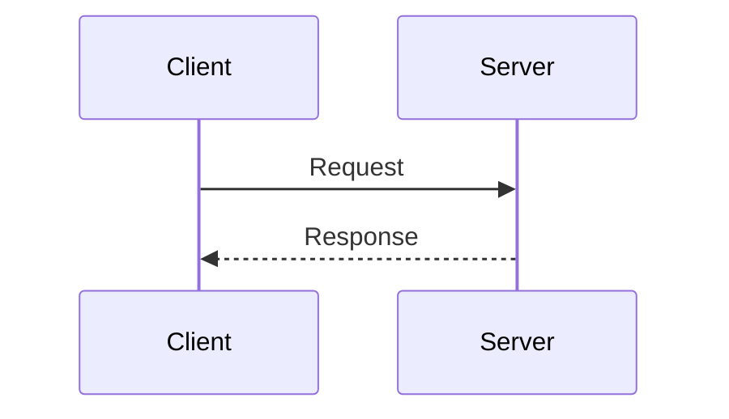

# AGENTS.md — JBrowser

AI coding tool guidelines for this repository.
This file focuses on **rules**. For design rationale, read the reference docs.

---

## Reference Docs

Read before making any structural change:

- `internal-docs/01-prd.md` — goals, non-goals, resource model, API contracts
- `internal-docs/02-architecture.md` — system design, data flow, DB schema, protocol

---

## Repository Layout

```
jbrowser/
├── crates/
│   ├── control-plane/   # Rust/Axum HTTP+WS server, REST API, CDP proxy
│   ├── agent/           # Rust binary: supervises Xvfb + Chrome + ffmpeg
│   └── shared/          # Protocol types shared by both crates
└── frontend/            # React SPA (Vite + TanStack Query + Zustand)
```

Rust crates form a Cargo workspace. Frontend is a separate npm project under `frontend/`.

---

## Tech Stack

| Layer | Stack |
|---|---|
| Control Plane | Rust, Axum 0.7+, Tokio, sqlx + MySQL |
| Agent | Rust, Tokio; spawns Xvfb / Chrome / ffmpeg as child processes |
| Frontend | TypeScript, React, Vite, TanStack Query, Zustand, MSE video |
| Auth | JWT (HS256), argon2 password hashing, tenant-scoped CDP tokens |
| Observability | `tracing` crate, Prometheus metrics endpoint |

---

## Code Rules

### Lint

**Rust** — the following must pass before any commit:
```sh
cargo fmt --all --check
cargo clippy --all-targets --all-features -- -D warnings
```
Do not suppress clippy warnings with `#[allow(...)]` unless the suppression includes a comment explaining why.

**TypeScript** — the following must pass:
```sh
pnpm lint       # eslint
pnpm type-check # tsc --noEmit
```
No `// eslint-disable` or `@ts-ignore` without an explanatory comment.

### Unit Tests

**Rust** — every non-trivial pure function and service method must have a `#[cfg(test)]` module in the same file.
Focus on:
- Auth/token validation logic
- Tenant isolation (queries must scope by `tenant_id`)
- Protocol frame encode/decode (`shared/src/protocol/`)
- Input coordinate mapping

Run with:
```sh
cargo test --all
```

**TypeScript** — co-locate test files as `*.test.ts` / `*.test.tsx`.
Focus on:
- Zustand store actions and state transitions
- `mapCoordinates` and other pure utility functions
- `PreviewPlayer` segment queuing logic

Run with:
```sh
pnpm test
```

### Rust Conventions

- Use `uuid` v7 (time-ordered) for all new IDs.
- Handler errors return structured JSON via the shared error type — don't use bare `anyhow` in handler return types.
- `sqlx` compile-time checked queries where practical; every query must scope with `WHERE tenant_id = ?`.
- `AgentManager` and `PreviewRegistry` are in-memory only (`DashMap` + broadcast channels) — don't persist agent runtime state to DB on the hot path.
- Agent WebSocket: text frames = JSON control, binary frames = video segments (see `shared/src/protocol/frames.rs`).

### TypeScript Conventions

- Server state → TanStack Query. Client state → Zustand. Don't mix them.
- Video playback goes through `PreviewPlayer` (MSE) — don't bypass it.
- Always map click coordinates to viewport space via `mapCoordinates` before dispatching input events.

### Security Invariants (never skip these)

- Every route handler and token check must verify `tenant_id` against JWT claims. Never trust a client-supplied tenant ID alone.
- The agent has no inbound ports — all agent communication is outbound WebSocket to control plane only.
- CDP port `:9222` binds `127.0.0.1` only inside the agent container.

---

## Documentation Rules

- All diagrams, flowcharts, and sequence diagrams must use **Mermaid**. No plain text / ASCII art.
- Write docs in the same language as the surrounding content (Chinese sections stay Chinese, English stays English).
- Keep `internal-docs/` accurate when changing architecture — outdated docs are worse than no docs.



---

## Intentional MVP Trade-offs — Do Not Change Without Discussion

- **Single WebSocket per agent** (JSON + binary multiplexed) — `stream_id` field is reserved for a future split.
- **In-memory fan-out** via `tokio::broadcast` — Redis pub/sub is the planned future path.
- **No CDP access lock** — multiple clients can connect concurrently; this is by design.
- **No session/run resource model** — agents are long-lived, not ephemeral.

