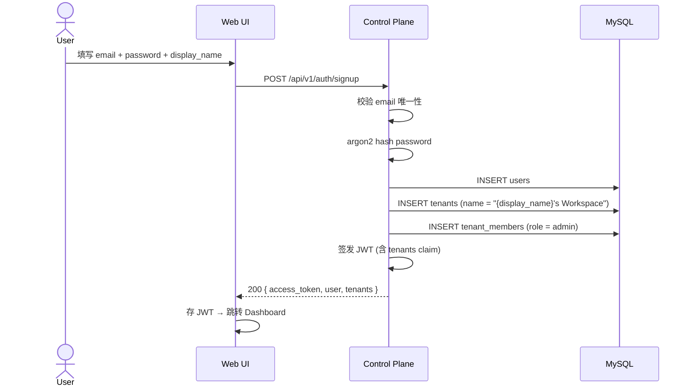
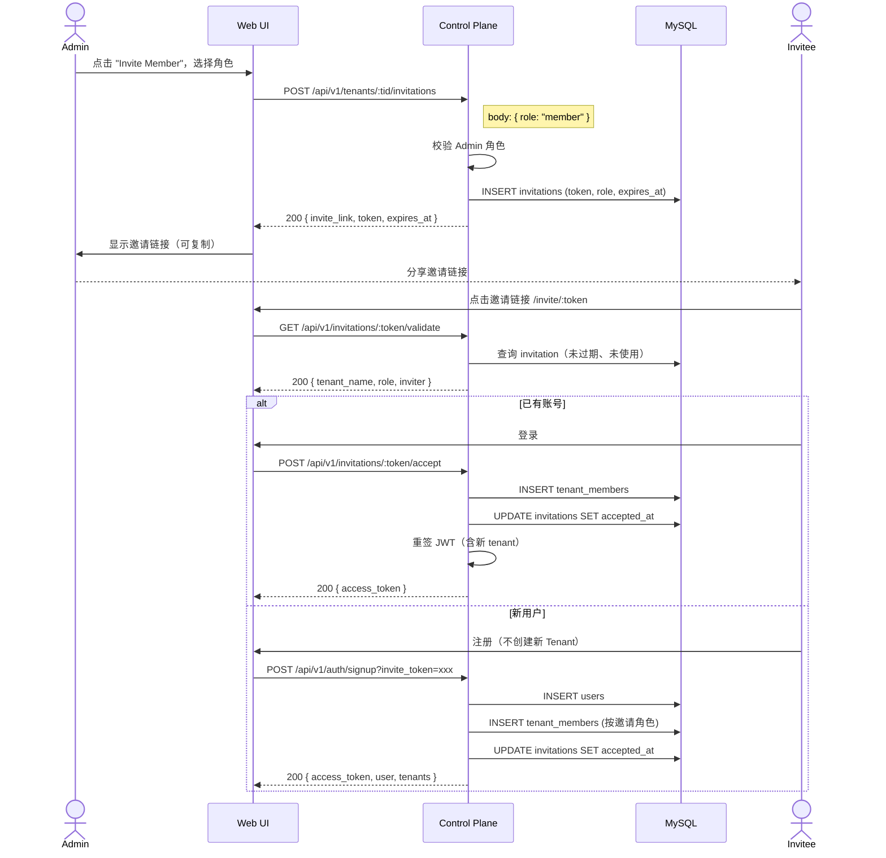
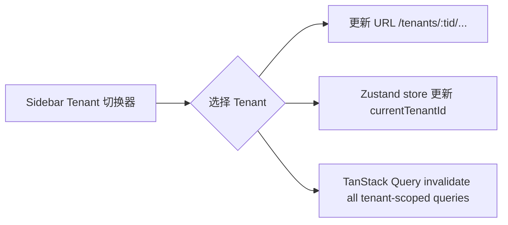

# JBrowser — Tenant Enhancement PRD

更新时间：2026-05-31

## 1. 背景与目标

当前 JBrowser 的 tenant 体系存在以下关键 gap：

- **运行时纯内存 HashMap**，重启丢数据，sqlx + MySQL 未接入
- **零用户管理**：没有注册、邀请、成员列表、踢人、改角色的 API
- **零租户管理**：没有创建/编辑 Tenant 的 API
- **RBAC 未实施**：schema 存了 admin/member 角色但代码从未检查
- delete_agent / delete_browser 存在 tenant 隔离 bug（先删再校验 tenant_id）
- 没有密码重置流程
- 没有邀请机制

本文档定义 **Tenant Isolation & Member Management Enhancement** 的完整需求。

## 2. 决策记录

| 决策点 | 结论 | 备注 |
|---|---|---|
| Tenant 创建方式 | Self-service | 用户注册时自动创建一个 Tenant，创建者为 admin |
| 用户注册方式 | Open Signup + Invite | 公开注册（创建新 Tenant）+ 被邀请加入已有 Tenant |
| 邀请机制 | 邀请链接为主，邮件可选 | MVP 先做 token-based 链接，邮件作为后续增强 |
| 角色体系 | Admin + Member（两种） | 复用现有 schema 的 `admin` / `member` 枚举 |
| 跨 Tenant | 支持 | 用户可属于多个 Tenant，前端有 Tenant 切换器 |
| 持久化 | 和 tenant 功能一起切到 MySQL + sqlx | 一步到位 |
| 前端 | Tenant Settings 页面 | 名称修改、成员列表、邀请管理、删除 Tenant |

## 3. 用户流程

### 3.1 注册（Signup）



**规则：**
- email 全局唯一
- 注册即创建一个默认 Tenant，slug 由 display_name 自动生成（kebab-case + 短随机后缀）
- 创建者自动成为该 Tenant 的 admin
- 返回结构与 login 一致

### 3.2 登录（Login）

沿用现有流程，但 JWT 的 `tenants` claim 需返回用户所有 tenant membership：

```json
{
  "sub": "user-uuid",
  "email": "user@example.com",
  "tenants": [
    { "id": "tenant-uuid-1", "slug": "jacks-workspace", "role": "admin" },
    { "id": "tenant-uuid-2", "slug": "acme-corp", "role": "member" }
  ],
  "exp": 1234567890
}
```

### 3.3 邀请成员（Invite）



**规则：**
- 只有 tenant admin 可创建邀请
- 邀请链接默认 7 天过期，单次使用
- 已注册用户 accept 后需重新获取 JWT
- 通过邀请注册的用户不自动创建新 Tenant

### 3.4 成员管理

| 操作 | 权限要求 | 说明 |
|---|---|---|
| 查看成员列表 | admin / member | 所有成员可见 |
| 邀请新成员 | admin only | 生成邀请链接 |
| 修改成员角色 | admin only | 不能修改自己，Tenant 至少保留一个 admin |
| 移除成员 | admin only | 不能移除自己，移除后该用户失去该 Tenant 下所有资源访问权 |
| 成员离开 Tenant | admin / member | 自己主动退出，admin 退出前需确保还有其他 admin |

### 3.5 Tenant 切换



- 前端 Sidebar 顶部显示当前 Tenant 名称 + 切换器下拉
- 切换后 URL path 中的 `:tid` 更新，所有数据重新加载
- JWT 不需要重签（已含所有 tenant claims）

## 4. RBAC 权限矩阵

| 资源/操作 | Admin | Member |
|---|---|---|
| 查看 browser instances | ✅ | ✅ |
| 操作 browser（点击/输入/滚动） | ✅ | ✅ |
| 查看 agent 列表 | ✅ | ✅ |
| 创建/吊销 agent registration token | ✅ | ❌ |
| 删除 agent | ✅ | ❌ |
| 创建/吊销 CDP access token | ✅ | ❌ |
| 查看审计日志 | ✅ | ❌ |
| 邀请成员 | ✅ | ❌ |
| 管理成员（改角色/移除） | ✅ | ❌ |
| 修改 Tenant 名称 | ✅ | ❌ |
| 删除 Tenant | ✅ | ❌ |
| 查看成员列表 | ✅ | ✅ |
| 离开 Tenant | ✅* | ✅ |

*Admin 离开前须确保至少还有一个 admin

## 5. API 设计

### 5.1 新增 Endpoints

```
# Auth
POST   /api/v1/auth/signup                           # 注册 + 自动创建 Tenant
POST   /api/v1/auth/change-password                  # 修改密码

# Invitations
POST   /api/v1/tenants/:tid/invitations              # 创建邀请 (admin)
GET    /api/v1/tenants/:tid/invitations              # 列出邀请 (admin)
DELETE /api/v1/tenants/:tid/invitations/:id           # 撤销邀请 (admin)
GET    /api/v1/invitations/:token/validate            # 验证邀请链接 (public)
POST   /api/v1/invitations/:token/accept              # 接受邀请 (authenticated)

# Members
GET    /api/v1/tenants/:tid/members                   # 成员列表
PATCH  /api/v1/tenants/:tid/members/:user_id          # 修改角色 (admin)
DELETE /api/v1/tenants/:tid/members/:user_id          # 移除成员 (admin)
POST   /api/v1/tenants/:tid/members/leave             # 自己退出

# Tenant Management
PATCH  /api/v1/tenants/:tid                           # 修改 Tenant 信息 (admin)
DELETE /api/v1/tenants/:tid                           # 删除 Tenant (admin)
```

### 5.2 请求/响应示例

#### POST /api/v1/auth/signup

```json
// Request
{
  "email": "jack@example.com",
  "password": "secureP@ss123",
  "display_name": "Jack"
}

// Response 200
{
  "access_token": "eyJ...",
  "user": {
    "id": "019f-...",
    "email": "jack@example.com",
    "display_name": "Jack"
  },
  "tenants": [
    { "id": "019f-...", "name": "Jack's Workspace", "slug": "jacks-workspace-a3x", "role": "admin" }
  ]
}
```

#### POST /api/v1/tenants/:tid/invitations

```json
// Request
{ "role": "member" }

// Response 200
{
  "id": "019f-...",
  "invite_link": "https://jbrowser.example.com/invite/abc123def456",
  "token": "abc123def456",
  "role": "member",
  "created_by": "019f-...",
  "expires_at": "2026-06-07T00:00:00Z"
}
```

#### GET /api/v1/tenants/:tid/members

```json
// Response 200
{
  "members": [
    {
      "user_id": "019f-...",
      "email": "jack@example.com",
      "display_name": "Jack",
      "role": "admin",
      "joined_at": "2026-05-31T12:00:00Z"
    },
    {
      "user_id": "019f-...",
      "email": "alice@example.com",
      "display_name": "Alice",
      "role": "member",
      "joined_at": "2026-05-31T14:30:00Z"
    }
  ]
}
```

## 6. 数据库变更

### 6.1 新增表：invitations

```sql
CREATE TABLE invitations (
    id          CHAR(36) PRIMARY KEY,
    tenant_id   CHAR(36) NOT NULL REFERENCES tenants(id),
    token_hash  VARCHAR(128) NOT NULL,
    token_prefix VARCHAR(8) NOT NULL,
    role        ENUM('admin', 'member') NOT NULL DEFAULT 'member',
    created_by  CHAR(36) NOT NULL REFERENCES users(id),
    accepted_by CHAR(36) NULL REFERENCES users(id),
    accepted_at TIMESTAMP NULL,
    expires_at  TIMESTAMP NOT NULL,
    created_at  TIMESTAMP NOT NULL DEFAULT CURRENT_TIMESTAMP,

    INDEX idx_invitations_tenant (tenant_id),
    INDEX idx_invitations_token_hash (token_hash)
);
```

### 6.2 现有表不变

`tenants`、`users`、`tenant_members` 表结构不变，已满足需求。

### 6.3 持久化切换

本次迭代需要：

1. 在 `AppState` 中引入 `sqlx::MySqlPool`，替换 `Arc<RwLock<Store>>`
2. 实现 `db/mod.rs`、`db/repo.rs` 中的 CRUD 函数
3. 所有查询 **必须** 带 `WHERE tenant_id = ?`（已有规范，需严格执行）
4. 新增 migration `0002_invitations.sql`
5. 修复 delete_agent / delete_browser 的先删后校验 bug

## 7. 前端变更

### 7.1 新增页面

| 页面 | 路径 | 功能 |
|---|---|---|
| Signup | `/signup` | 注册表单 |
| Accept Invite | `/invite/:token` | 邀请着陆页，显示 Tenant 信息，注册/登录后自动加入 |
| Tenant Settings | `/tenants/:tid/settings` | Tenant 名称修改、成员列表、邀请管理、删除 Tenant |

### 7.2 组件变更

| 组件 | 变更 |
|---|---|
| Sidebar | 顶部增加 Tenant 切换器（下拉菜单，显示所有 tenant） |
| Login | 增加 "Create Account" 链接跳转注册页 |
| 路由 | 增加 signup / invite / settings 路由 |

### 7.3 Store 变更

```typescript
// stores/auth.ts — 新增
interface AuthState {
  // 现有
  token: string | null;
  user: User | null;
  tenants: TenantMembership[];

  // 新增
  currentTenantId: string | null;          // 当前选中的 Tenant
  switchTenant: (tid: string) => void;     // 切换 Tenant
  currentTenant: () => TenantMembership | null;  // 当前 Tenant 信息
  isAdmin: () => boolean;                  // 当前 Tenant 下是否是 admin
}
```

## 8. 安全要求

- [ ] 所有新 handler 必须校验 JWT + tenant_id
- [ ] admin-only 操作必须检查 `role == "admin"`
- [ ] 邀请 token 存储 argon2 hash，不存明文
- [ ] 邀请链接 token 长度 ≥ 32 字符，密码学随机
- [ ] 修复现有 delete_agent / delete_browser 先删后校验的 tenant 隔离 bug
- [ ] 密码强度：最少 8 位
- [ ] signup rate limiting（可后续迭代）

## 9. 不在本次迭代范围

- SSO / OIDC / SAML（PRD 明确非目标）
- 邮件发送服务（邀请链接手动分享）
- Tenant quota / billing
- 密码重置（邮件依赖，后续迭代）
- 用户头像
- Tenant logo/branding
