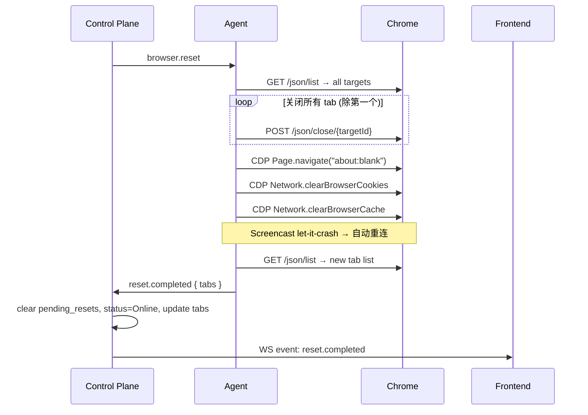

# Design: Browser Reset — 完整实现

更新时间：2026-05-31（经 grill 审查修订）

## 1. 现状分析

当前 reset 实现有以下问题：

| 问题 | 描述 |
|------|------|
| 状态不同步 | CP 立即设 `status=Restarting`，但 `handle_agent_text` 每条消息都无条件改回 `Online` |
| 无 Storage 清理 | 只清 Cookie/Cache，不清 localStorage/sessionStorage/IndexedDB |
| 无超时保护 | Agent 侧 reset 如果失败，browser 永远卡在 `Restarting`（实际因 heartbeat 覆写很快恢复，但也意味着 Restarting 状态无意义） |
| Tab 状态硬编码 | CP 直接写入假的 `{id: "blank"}` tab，不对应任何真实 Chrome target |
| 无 reset 完成确认 | 无 ACK 机制，前端无法知道 reset 何时完成 |
| WS 路径不一致 | HTTP reset 设 `status=Restarting`；WS `browser.reset` 只转发不改状态 |
| Agent 离线不检测 | `try_send` 静默失败，browser 仍设 Restarting |

## 2. 设计目标

- **原子性**：reset 是一个有明确开始/完成/超时的操作
- **可观察**：前端通过 WS 事件实时感知 reset 结果
- **幂等**：reset 进行中拒绝重复请求（409）
- **容错**：Agent 失败自动通知；30s 超时自动恢复

## 3. 设计决策记录

| # | 问题 | 决策 | 理由 |
|---|------|------|------|
| 1 | Screencast 暂停 | **不暂停**，let-it-crash | 现有自愈重连（100ms~2s）已够用，前端遮罩层掩盖闪烁，避免新增 watch channel + error path cleanup 复杂度 |
| 2 | Storage 清理范围 | **实用主义**：Cookie + Cache + 关闭 tab | `Storage.clearDataForOrigin` 不支持通配符 `*`；残留的 localStorage/IDB 因 origin 隔离不影响新会话 |
| 3 | ACK 消息类型 | **只保留 `reset.completed` / `reset.failed`**，去掉 `reset.started` | CP 发命令时已知 reset 开始；Agent WS 如果连通就一定会处理；30s 超时覆盖无响应场景 |
| 4 | Heartbeat 覆写 | **`pending_resets` 存在期间跳过 status=Online 覆写**，heartbeat 时间戳和 tab 列表继续更新 | 防止 `tab.list` 心跳在 reset 完成前把 status 改回 Online |
| 5 | Reset 期间 Tab 状态 | **清空 tabs**：`tabs = []`, `active_tab_id = None` | 明确表示无可用 tab；前端在 Restarting 状态下显示遮罩层 |
| 6 | 重复 reset | **409 Conflict** | 前端禁用按钮 + 后端防御性检查 |
| 7 | Reset 入口 | **仅 HTTP POST**，移除 WS 转发 `browser.reset` | Reset 是破坏性操作，需要明确的 HTTP 状态码反馈（200/409/503） |
| 8 | 超时恢复 | **只清 `pending_resets`**，不主动探测 Agent | 让 heartbeat 自然恢复 status 和 tabs；如果 Agent 真崩了，现有 heartbeat 超时检测会标记 Unhealthy |
| 9 | request_id | **去掉** | 同时只允许一个 reset，用 browser_id 匹配即可 |
| 10 | 前端感知完成 | **WS 事件推送** `reset.completed` / `reset.failed` | 已有 Control WebSocket 连接，加事件类型代价低，比轮询实时 |
| 11 | 视频画面 | **冻结最后一帧 + 半透明遮罩 + spinner** | 让用户知道"操作进行中"而非"画面卡了" |
| 12 | 超时检查实现 | **后台 `tokio::spawn` + `tokio::time::interval`**，每 10s 扫描 | CP 首个后台任务，未来可复用于 heartbeat 检测、metrics 等 |
| 13 | Agent 离线 | **503 立即失败**，不设 Restarting | `agent_senders` 无 sender 或 `try_send` 失败时直接报错 |
| 14 | `pending_resets` 存储 | **单独 `RwLock<HashMap<Uuid, Instant>>` 在 AppState** | 保持 BrowserInstance 模型纯净，不污染 API 响应 |
| 15 | 输入事件拦截 | **前端拦截**：`status === 'restarting'` 时不发送 | 一行判断，避免无谓 WS 消息和 Agent 日志噪音 |

## 4. 协议设计

### 4.1 Control → Agent 命令（已有，不变）

```json
{
  "type": "browser.reset",
  "payload": { "browserInstanceId": "uuid" }
}
```

> 注：不再携带 `request_id`（决策 #9）。

### 4.2 Agent → Control ACK（新增）

```json
// Agent 完成 reset
{
  "type": "reset.completed",
  "payload": {
    "tabs": [{ "id": "new-target-id", "title": "New Tab", "url": "about:blank", "active": true }]
  }
}

// Agent reset 失败
{
  "type": "reset.failed",
  "payload": {
    "error": "reason string"
  }
}
```

> 注：`browserInstanceId` 不需要在 payload 中——Agent 只管一个 browser，CP 通过 agent_id → browser_id 映射来确定。

## 5. Agent 侧 Reset 流程



### 5.1 Agent 实现伪代码

```rust
async fn handle_browser_reset(_payload: &Value) -> Result<()> {
    let client = reqwest::Client::new();

    // 1. 获取所有 page targets
    let targets: Vec<Value> = client
        .get("http://localhost:9222/json/list")
        .send().await?.json().await?;
    let pages: Vec<_> = targets.iter()
        .filter(|t| t["type"].as_str() == Some("page"))
        .collect();

    // 2. 关闭除第一个外的所有 tab
    for tab in pages.iter().skip(1) {
        if let Some(id) = tab["id"].as_str() {
            let _ = client.post(format!("http://localhost:9222/json/close/{id}"))
                .send().await;
        }
    }

    // 3. 在剩余 tab 上执行清理
    if let Some(tab) = pages.first() {
        if let Some(ws_url) = tab["webSocketDebuggerUrl"].as_str() {
            let (mut ws, _) = connect_async(ws_url).await?;
            // Navigate to about:blank
            ws.send(Message::Text(
                json!({"id":1,"method":"Page.navigate","params":{"url":"about:blank"}}).to_string()
            )).await?;
            // Clear cookies + cache
            ws.send(Message::Text(
                json!({"id":2,"method":"Network.clearBrowserCookies","params":{}}).to_string()
            )).await?;
            ws.send(Message::Text(
                json!({"id":3,"method":"Network.clearBrowserCache","params":{}}).to_string()
            )).await?;
            // 等待 CDP 响应（至少读到 id:3 的响应）
            // ... read ws messages until all 3 responses received or 5s timeout ...
            ws.close(None).await.ok();
        }
    }

    // 4. 获取新 tab 列表并上报完成
    let new_targets: Vec<Value> = client
        .get("http://localhost:9222/json/list")
        .send().await?.json().await?;
    let tabs: Vec<Value> = new_targets.iter()
        .filter(|t| t["type"].as_str() == Some("page"))
        .map(|t| json!({
            "id": t["id"],
            "title": t["title"],
            "url": t["url"],
            "active": true
        }))
        .collect();

    send_to_control(Message::Text(
        json!({"type": "reset.completed", "payload": {"tabs": tabs}}).to_string()
    )).await;

    Ok(())
}
```

**错误路径**：整个函数包裹在 `match` 中，失败时发送 `reset.failed`：

```rust
// 在 dispatch_control_message 中
"browser.reset" => {
    match handle_browser_reset(&msg.payload).await {
        Ok(()) => {} // reset.completed 已在函数内发送
        Err(e) => {
            send_to_control(Message::Text(
                json!({"type": "reset.failed", "payload": {"error": e.to_string()}}).to_string()
            )).await;
        }
    }
}
```

## 6. Control Plane 侧变更

### 6.1 AppState 新增

```rust
pub struct AppState {
    // ...existing fields...
    /// browser_id → reset 开始时间。存在期间 handle_agent_text 不覆写 status。
    pub pending_resets: RwLock<HashMap<Uuid, Instant>>,
}
```

### 6.2 HTTP `reset_browser` handler 变更

```rust
async fn reset_browser(...) -> Result<Json<Value>, AppError> {
    let claims = authorize(...).await?;

    // 检查是否已在 reset 中（决策 #6：409）
    {
        let resets = state.pending_resets.read().await;
        if resets.contains_key(&browser_id) {
            return Err(AppError::conflict("reset already in progress"));
        }
    }

    let snapshot = {
        let mut browsers = state.browsers.write().await;
        let browser = browsers.get_mut(&browser_id)
            .filter(|b| b.tenant_id == tenant_id)
            .ok_or_else(|| AppError::not_found("browser instance"))?;

        // 检查 Agent 是否可达（决策 #13：503）
        let senders = state.agent_senders.read().await;
        let tx = senders.get(&browser.agent_id)
            .ok_or_else(|| AppError::service_unavailable("agent not connected"))?;

        let cmd = serde_json::to_string(&json!({
            "type": "browser.reset",
            "payload": { "browserInstanceId": browser_id }
        })).unwrap();

        tx.try_send(cmd)
            .map_err(|_| AppError::service_unavailable("agent channel full"))?;

        // 设状态（决策 #5：清空 tabs）
        browser.status = BrowserStatus::Restarting;
        browser.tabs = vec![];
        browser.active_tab_id = None;
        browser.clone()
    };

    // 记录 pending reset（决策 #14：单独 HashMap）
    {
        let mut resets = state.pending_resets.write().await;
        resets.insert(browser_id, Instant::now());
    }

    Ok(Json(json!({ "data": snapshot })))
}
```

### 6.3 `handle_agent_text` 变更

```rust
async fn handle_agent_text(state: &AppState, agent_id: Uuid, browser_id: Uuid, value: Value) {
    let msg_type = value.get("type").and_then(Value::as_str).unwrap_or("");

    match msg_type {
        "reset.completed" => {
            // 清除 pending reset
            state.pending_resets.write().await.remove(&browser_id);
            // 更新 browser 状态
            let mut browsers = state.browsers.write().await;
            if let Some(browser) = browsers.get_mut(&browser_id) {
                browser.status = BrowserStatus::Online;
                if let Some(tabs) = value.pointer("/payload/tabs") {
                    if let Ok(parsed) = serde_json::from_value::<Vec<BrowserTab>>(tabs.clone()) {
                        browser.active_tab_id = parsed.iter()
                            .find(|t| t.active).map(|t| t.id.clone());
                        browser.tabs = parsed;
                    }
                }
            }
            // 广播给前端（决策 #10）
            broadcast_to_viewers(state, browser_id, json!({"type": "reset.completed"})).await;
        }
        "reset.failed" => {
            state.pending_resets.write().await.remove(&browser_id);
            let mut browsers = state.browsers.write().await;
            if let Some(browser) = browsers.get_mut(&browser_id) {
                browser.status = BrowserStatus::Online;
            }
            let error = value.pointer("/payload/error")
                .and_then(Value::as_str).unwrap_or("unknown");
            broadcast_to_viewers(state, browser_id,
                json!({"type": "reset.failed", "error": error})).await;
        }
        _ => {
            // 现有逻辑，但增加 pending_resets 检查（决策 #4）
            let is_resetting = state.pending_resets.read().await.contains_key(&browser_id);
            let mut browsers = state.browsers.write().await;
            if let Some(browser) = browsers.get_mut(&browser_id) {
                if !is_resetting {
                    browser.status = BrowserStatus::Online; // 只在非 reset 期间覆写
                }
                // heartbeat 和 tab 列表照常更新
                browser.last_heartbeat_at = Some(Utc::now().to_rfc3339());
                if msg_type == "tab.list" {
                    // ...existing tab parsing...
                }
            }
        }
    }
}
```

### 6.4 WS `handle_control_text` 变更（决策 #7）

```rust
// 从 WS 转发列表中移除 "browser.reset"
"input.event" | "tab.command" | "navigate.url" | "navigate.back"
| "navigate.forward" | "navigate.reload" => {
    // ...forward to agent...
}
// browser.reset 不再出现在此列表中
```

### 6.5 后台超时任务（决策 #12）

```rust
// 在 main.rs 中，axum::serve 之前 spawn
let state_clone = state.clone();
tokio::spawn(async move {
    let mut interval = tokio::time::interval(Duration::from_secs(10));
    loop {
        interval.tick().await;
        let mut resets = state_clone.pending_resets.write().await;
        resets.retain(|browser_id, started_at| {
            if started_at.elapsed() > Duration::from_secs(30) {
                warn!(%browser_id, "reset timed out, clearing pending state");
                false // remove from map
            } else {
                true
            }
        });
        // pending_resets 被清除后，下一次 heartbeat 会自然恢复 status=Online
    }
});
```

## 7. 前端变更

### 7.1 视频画面（决策 #11）

```tsx
// BrowserDetail.tsx — canvas 区域
{browser.status === 'restarting' && (
  <div className="reset-overlay">
    <Spinner />
    <span>Resetting...</span>
  </div>
)}
```

### 7.2 Reset 按钮（决策 #6 + #10）

```typescript
const resetMutation = useMutation({
    mutationFn: () => resetBrowser(tenantId, browserId),
    onSuccess: () => {
        // 不立即 invalidate——等 WS 事件
    },
    onError: (error) => {
        // 409 → "Reset already in progress"
        // 503 → "Agent not available"
        toast.error(error.message);
    },
});

// 按钮禁用条件
<button
    disabled={browser.status === 'restarting' || resetMutation.isPending}
    onClick={() => resetMutation.mutate()}
>
    {browser.status === 'restarting' ? 'Resetting...' : 'Reset'}
</button>
```

### 7.3 WS 事件监听（决策 #10）

```typescript
// control.ts — 新增事件类型
export type ControlEvent =
  | { type: 'browser.state'; payload: unknown }
  | { type: 'tab.list'; payload: unknown }
  | { type: 'preview.segment'; payload: ArrayBuffer }
  | { type: 'reset.completed'; payload: unknown }
  | { type: 'reset.failed'; payload: { error: string } }
  | { type: 'error'; payload: unknown };

// BrowserDetail.tsx — 监听处理
useEffect(() => {
    const handler = (event: ControlEvent) => {
        if (event.type === 'reset.completed') {
            queryClient.invalidateQueries({ queryKey: ['browser', tenantId, browserId] });
            toast.success('Browser reset complete');
        } else if (event.type === 'reset.failed') {
            queryClient.invalidateQueries({ queryKey: ['browser', tenantId, browserId] });
            toast.error(`Reset failed: ${event.payload.error}`);
        }
    };
    controlSocket.on('message', handler);
    return () => controlSocket.off('message', handler);
}, []);
```

### 7.4 输入拦截（决策 #15）

```typescript
// InputOverlay.tsx
const handlePointerEvent = (e: PointerEvent) => {
    if (browserStatus === 'restarting') return; // 决策 #15
    // ...existing coordinate mapping and WS send...
};
```

## 8. SOP 验证步骤

```bash
# 1. 启动环境
make up

# 2. 通过 UI 导航到某个网站（产生 cookie/cache）

# 3. 验证 reset 前状态
curl -s localhost:3000/api/v1/tenants/$TID/browser-instances/$BID \
  -H "Authorization: Bearer $TOKEN" | jq '.data.status'
# 预期: "online"

# 4. 执行 reset
curl -X POST localhost:3000/api/v1/tenants/$TID/browser-instances/$BID/reset \
  -H "Authorization: Bearer $TOKEN" | jq '.data'
# 预期: status="restarting", tabs=[], active_tab_id=null

# 5. 观察 Agent 日志
docker logs -f docker-agent-chromium-1 2>&1 | grep -i reset
# 预期: 看到 reset 执行日志，然后 "reset.completed" 发送

# 6. 验证 reset 后状态（等 2-3 秒）
curl -s localhost:3000/api/v1/tenants/$TID/browser-instances/$BID \
  -H "Authorization: Bearer $TOKEN" | jq '.data'
# 预期: status="online", tabs=[{url: "about:blank", ...}]

# 7. 验证 Cookie 清理
# 通过 CDP: Network.getAllCookies → cookies 数组应为空

# 8. 重复 reset 测试（409）
curl -X POST localhost:3000/api/v1/tenants/$TID/browser-instances/$BID/reset \
  -H "Authorization: Bearer $TOKEN"
# 在第一次 reset 进行中时发送第二次
# 预期: HTTP 409 Conflict

# 9. Agent 离线测试（503）
docker stop docker-agent-chromium-1
curl -X POST localhost:3000/api/v1/tenants/$TID/browser-instances/$BID/reset \
  -H "Authorization: Bearer $TOKEN"
# 预期: HTTP 503 Service Unavailable
docker start docker-agent-chromium-1

# 10. 超时测试
# 停止 Agent 进程（不停容器），发送 reset
# 30s 后 pending_resets 应被清除
# 下一次 heartbeat 恢复后 status 回到 online

# 11. 前端测试
# 点击 Reset → 按钮变灰 + canvas 显示遮罩层 + spinner
# 完成后 → toast "Reset complete" + 遮罩消失 + canvas 显示 about:blank
```

## 9. 影响范围

| 文件 | 变更 |
|------|------|
| `crates/agent/src/main.rs` | 重写 `handle_browser_reset`：增加 CDP 响应等待 + 发送 `reset.completed` / `reset.failed` ACK |
| `crates/control-plane/src/server.rs` | `reset_browser`: 409 检查 + 503 检查 + 清空 tabs + 写 pending_resets；`handle_agent_text`: 处理 ACK + pending_resets 期间不覆写 status；`handle_control_text`: 移除 WS `browser.reset` 转发 |
| `crates/control-plane/src/main.rs` | 新增后台 `tokio::spawn` 超时扫描任务 |
| `frontend/src/pages/BrowserDetail.tsx` | Reset 按钮禁用状态 + canvas 遮罩层 + WS 事件监听 |
| `frontend/src/ws/control.ts` | 新增 `reset.completed` / `reset.failed` 事件类型 |
| `frontend/src/components/InputOverlay.tsx` | Restarting 状态下不发送输入事件 |
